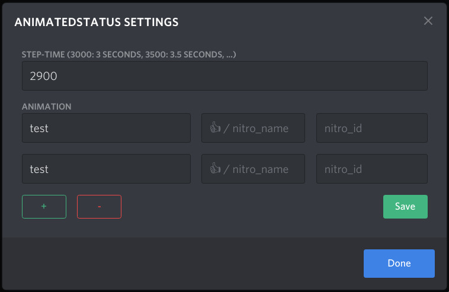
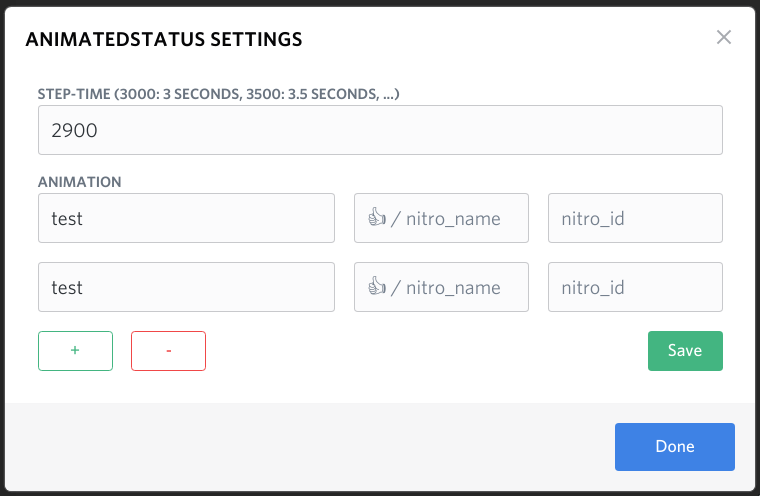
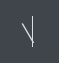
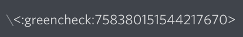
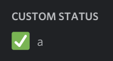
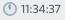

# BetterDiscord-Animated-Status

* [Установка](#Installation)
* [использование](#Usage)
* [Настройки](#Settings)
  * [Тайм-аут](#Timeout)
  * [Редактор](#The-Editor)
  * [смайлики](#Emojis)
    * [Regular Emoji](#Regular-Emoji)
    * [Nitro Emoji](#Nitro-Emoji)
  * [Примеры](#Examples)

## Installation
Установить с помощью очень удобного [BetterDiscord installer](https://github.com/BetterDiscord/Installer/releases/latest) \
Скачать [Animated_Status.plugin.js](/Animated_Status.plugin.js?raw=true) в следующий каталог \
Mac: `~/Library/Preferences/BetterDiscord`\
Windows: `%appdata%\BetterDiscord\plugins`\
Linux: `~/.config/BetterDiscord/plugins`

## Usage
Откройте Discord, перейдите в «Настройки»/>«Плагины», включите AnimatedStatus и нажмите «Настройки».\
Введите необходимую информацию в поля ввода и нажмите кнопку `Сохранить`.
Нажатие `Готово` без сохранения приведет к сбросу настроек.

## Settings
<table align=center">
  <td>  </td>
  <td>  </td>
</table>

### Timeout
Значение указывает продолжительность каждого шага анимации в миллисекундах.
Пример: при тайм-ауте 2000 следующая анимация займет 4 секунды, так как 2 ключевых кадра длятся по 2 секунды каждый.
```
abc
def
```
Чтобы сервер разногласий не был завален запросами, минимально допустимый тайм-аут жестко закодирован и составляет 2,9 секунды. \
По логике, тайм-аут анимации должен быть не менее `2900`. В лучшем случае это должно быть примерно «10000» миллисекунд (10 секунд), чтобы анимация выглядела плавно на других клиентах. \
В мобильном приложении статус не обновляется последовательно, т. е. список участников сервера обновляется в зависимости от действий пользователей в приложении. Не удивляйтесь, если анимация не выглядит плавной или пропускает кадры. \
^ According to [@pintoso](https://github.com/pintoso)

### The Editor
Каждая ячейка, добавленная с помощью кнопки `+`, добавляет новый шаг к анимации состояния. \
Нажатие кнопки `-`-удалит последний шаг. \Пустая ячейка временно удалит ваш статус. Это было добавлено по запросу, но может быть изменено в будущем.

В последней версии было принято решение убрать из плагина необработанный редактор. Это был просто нестабильный текстовый интерфейс к конфигурационному файлу JSON. \
**Вы по-прежнему можете использовать режим RAW**, нажав «Открыть папку плагинов» в настройках и отредактировав «AnimatedStatus.config.json». Делайте это на свой страх и риск, можете что-нибудь сломать.

### Emojis
#### Regular Emoji
Используйте селектор эмодзи (Windows: <kbd>Win</kbd>+<kbd>.</kbd>). \
В качестве альтернативы используйте [a unicode table](https://unicode.org/emoji/charts/full-emoji-list.html) и скопируйте смайлик, который вы хотите использовать в качестве своего статуса. \
Поле `emoji_name` **не может содержать пробелов**. В противном случае сервер разногласий молча проигнорирует ваш запрос статуса.
Из-за неуверенности в именах нитро смайликов плагин в настоящее время не удаляет пробелы автоматически.

#### Nitro Emoji
- Откройте чат в дискорде, введите `\`. \
  
- Выберите смайлик, который вы хотите включить в свой статус, с помощью средства выбора смайликов. \
  
- Обратите внимание, что сообщение изменилось на `<:emojiname:emojiid>`. Значения в скобках (emojiname и emojiid) — это значения, необходимые для статуса. \
  
- Отредактируйте настройки соответствующим образом \
  

### Examples
Некоторые скриншоты ускорены, поэтому ReadMe выглядит более привлекательно.

#### Часы
- **Result:** \
  
- **Emoji-Field:** \
  <code> eval ['🕛','🕐','🕑','🕒','🕓','🕔','🕕','🕖','🕗','🕘','🕙','🕚'][((new Date()).getHours()%12)]; </code>

#### Часы и с текстом
- **Result:** \
  
- **Emoji-Field:** \
  <code> eval ['🕛','🕐','🕑','🕒','🕓','🕔','🕕','🕖','🕗','🕘','🕙','🕚'][((new Date()).getHours()%12)]; </code>
- **Text-Field:** \
  <code> eval let fmt=t=>(t<10?'0':'')+t;let d=new Date();`${fmt(d.getHours())}:${fmt(d.getMinutes())}:${fmt(d.getSeconds())}`; </code>

